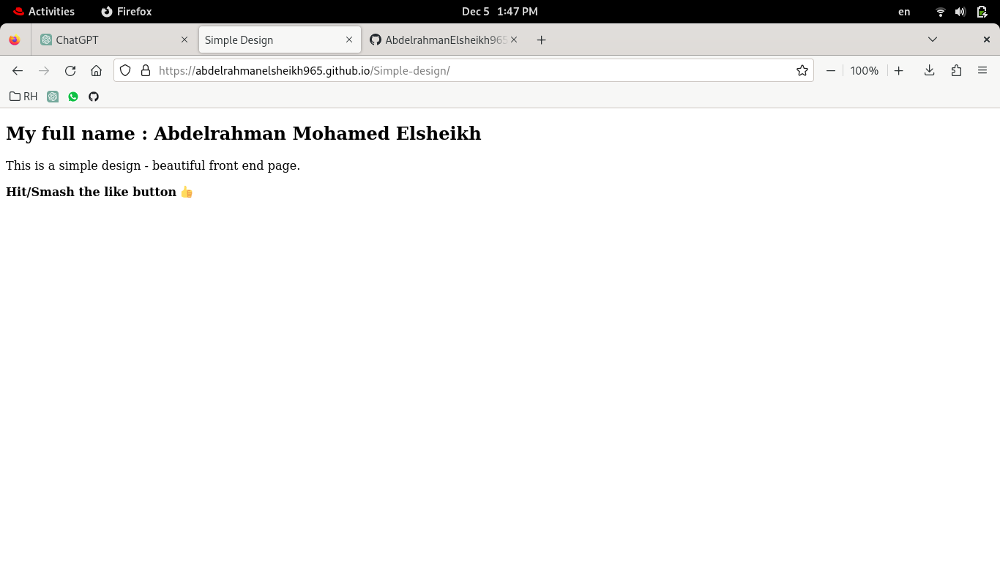

# Lab 1

### Create SSH key and put the key in Github


#### 1. **SSH Key Setup (Optional but Recommended for Secure Authentication):**

- Generate an SSH key pair if you haven't already:

    ```bash
    ssh-keygen -t rsa -b 4096 -C "your_email@example.com"
    ```

- Follow the prompts to generate the SSH key. This will create a public and private key pair.

#### 2. **Add SSH Key to the SSH Agent:**

- Start the SSH agent (if not running):

    ```bash
    eval "$(ssh-agent -s)"
    ```

- Add your SSH private key to the SSH agent:

    ```bash
    ssh-add ~/.ssh/id_rsa  # Replace `id_rsa` with your private key filename if different
    ```

#### 3. **Add SSH Public Key to Git Hosting Service:**

- Copy the contents of your SSH public key (`~/.ssh/id_rsa.pub` by default):

- For GitHub:
    - Go to GitHub > Settings > SSH and GPG keys > New SSH key.
    - Paste your SSH public key.

#### 4. **Configure Git to Use SSH:**

- Set Git to use SSH URLs for remote repositories:

    ```bash
    git config --global url."git@github.com:".insteadOf "https://github.com/"
    ```

#### 5. **Clone Repositories Using SSH:**

- Clone repositories using SSH URLs:

    ```bash
    git clone git@github.com:username/repository.git
    ```

#### 6. **Additional Configuration (Optional):**

- Set your Git username and email (if not already set):

    ```bash
    git config --global user.name "Your Name"
    git config --global user.email "your_email@example.com"
    ```

### Note:
- These steps primarily focus on using SSH for authentication, which is secure and recommended.
- Always protect your SSH private key and never share it with anyone.
- If SSH isn't an option, using HTTPS URLs with username/password authentication is an alternative, though less secure.

Firstly generate ssh key


Paste public gpg key in Github


### Create a new local repo and a remote repo on GitHub, then make a file contains your full name, then push it to the remote repo, and send an invitation to me.

```
git init
touch index.html
```
creating the file through command line

page content

add remote link to the local repo


push to remote


Manage your collaborators


### Host your project with github pages

Specify the wanted branch to be hosted

View the page hosted online
